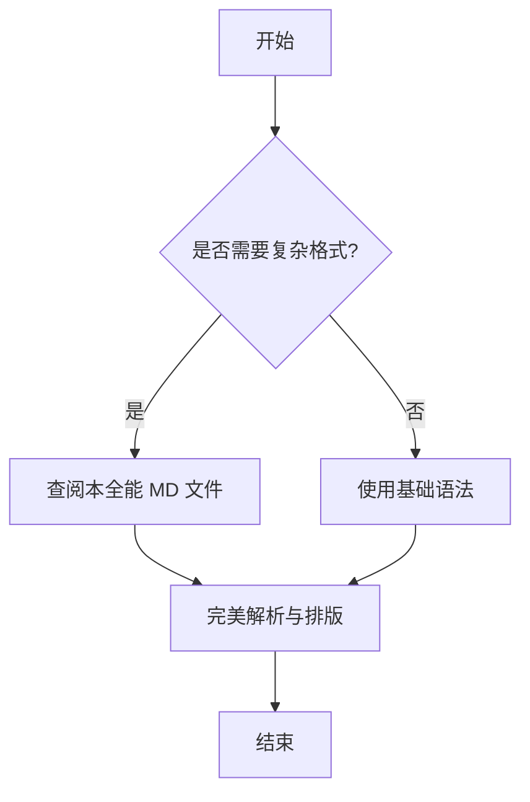
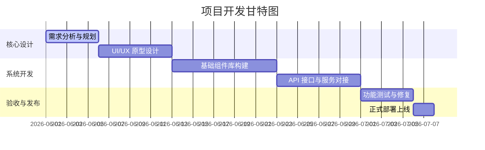

# Markdown 全能语法与格式测试文档 (Comprehensive Markdown Test & Cheat Sheet)

这是一个用于测试 Markdown 解析器、渲染器以及日常查阅语法的高级演示文件。它包含了基础 Markdown、GitHub Flavored Markdown (GFM) 以及各种常见的扩展语法和排版规范。

---

## 1. 基础文本样式 (Basic Text Styles)

### 1.1 标题等级 (Headings)

# 一级标题 (H1)
## 二级标题 (H2)
### 三级标题 (H3)
#### 四级标题 (H4)
##### 五级标题 (H5)
###### 六级标题 (H6)

---

### 1.2 字体强调 (Emphasis)

*   *斜体文本* (使用单星号 `*`)
*   _斜体文本_ (使用单下划线 `_`)
*   **粗体文本** (使用双星号 `**`)
*   __粗体文本__ (使用双下划线 `__`)
*   ***粗斜体文本*** (使用三星号 `***`)
*   ~~删除线~~ (使用双波浪线 `~~`)
*   <u>下划线</u> (使用 HTML 标签 `<u>`)
*   ==标记/高亮== (使用双等号 `==`，部分渲染器支持)
*   正常文本与 ^上标^ (如 `x^2^`) 以及 ~下标~ (如 `H~2~O`)

---

### 1.3 段落与换行 (Paragraphs & Line Breaks)

这是第一段普通的文本。段落之间必须空一行以示分隔。

这是第二段普通的文本。如果你想在段落内强制换行，可以在行末添加两个或更多空格，然后按回车，  
或者直接在行尾使用 HTML 的 `<br>` 标签。<br>这样就可以在不产生新段落的情况下另起一行。

---

## 2. 列表 (Lists)

### 2.1 无序列表 (Unordered Lists)

*   星号列表项 1
    *   嵌套列表项 1.1
    *   嵌套列表项 1.2
*   星号列表项 2
-   减号列表项 1
+   加号列表项 1

### 2.2 有序列表 (Ordered Lists)

1.  第一项
2.  第二项
    1.  嵌套有序项 2.1
    2.  嵌套有序项 2.2
3.  第三项

### 2.3 任务列表 (GFM Task Lists)

- [x] 已完成的任务项 1
- [ ] 未完成的任务项 2
- [ ] 待办任务项 3 (点击可在支持的编辑器中勾选)

### 2.4 自定义/定义列表 (Definition Lists - CommonMark Extension)

名词 1
:   这是名词 1 的定义和解释。

名词 2
:   这是名词 2 的定义。
:   这是名词 2 的第二个解释。

---

## 3. 引用与呼应区 (Blockquotes & Alerts)

### 3.1 基础引用 (Standard Blockquotes)

> 这是一个单行引用块。
> 可以包含多行。Markdown 解析器会自动拼接它们。

> 这是一个多段落引用。
>
> 引用内的第二段，需要空一行并带上 `>` 符号。

> 嵌套引用测试
> > 这是二级嵌套引用。
> > > 这是三级嵌套引用。

### 3.2 GitHub 风格的警告框 (GFM Alerts / Callouts)

> [!NOTE]
> 这是一个普通提示信息 (Note)。用于提供背景信息或补充说明。

> [!TIP]
> 这是一个技巧/最佳实践 (Tip)。用于提高效率或改善体验。

> [!IMPORTANT]
> 这是一个重要通知 (Important)。用户必须注意的关键信息。

> [!WARNING]
> 这是一个警告 (Warning)。可能导致出错或偏离预期的操作。

> [!CAUTION]
> 这是一个危险警告 (Caution)。可能导致数据丢失、安全风险或不可逆后果。

---

## 4. 代码块与格式化 (Code & Formatting)

### 4.1 行内代码 (Inline Code)

使用反引号可在句中插入行内代码，例如 `const message = "Hello World"` 或运行命令 `git status`。

### 4.2 围栏代码块 (Fenced Code Blocks)

#### Python 示例
```python
def greet(name: str) -> str:
    """这是一个打招呼的 Python 函数"""
    message = f"Hello, {name}!"
    print(message)
    return message

greet("Antigravity")
```

#### JavaScript/TypeScript 示例
```javascript
// 异步获取数据
async function fetchData(url) {
  try {
    const response = await fetch(url);
    if (!response.ok) {
      throw new Error(`HTTP error! status: ${response.status}`);
    }
    const data = await response.json();
    return data;
  } catch (error) {
    console.error("Could not fetch data: ", error);
  }
}
```

#### CSS 示例
```css
:root {
  --primary-color: #4a90e2;
  --bg-dark: #121212;
  --transition-smooth: all 0.3s cubic-bezier(0.4, 0, 0.2, 1);
}

.card {
  background: rgba(255, 255, 255, 0.05);
  backdrop-filter: blur(10px);
  border-radius: 12px;
  transition: var(--transition-smooth);
}
```

---

## 5. 链接与媒体 (Links & Media)

### 5.1 基础链接 (Basic Links)

*   [标准超链接](https://www.wikipedia.org)
*   [带悬停提示的链接](https://www.wikipedia.org "维基百科首页")
*   自动链接: <https://www.wikipedia.org> (或者直接写邮箱 <example@example.com>)

### 5.2 引用式链接 (Reference Links)

我们可以使用引用链接来保持正文的整洁。
例如，这里引用了 [Google Search][google] 和 [Github 官方网站][github]。

[google]: https://www.google.com "Google 搜索引擎"
[github]: https://github.com "GitHub 代码托管平台"

### 5.3 图片展示 (Images)

#### 标准图片


#### 带悬停文字的图片


---

## 6. 表格 (Tables - GFM)

| 姓名 (左对齐) | 年龄 (居中对齐) | 职业 (右对齐) | 备注 (默认)    |
| :------------ | :-------------: | ------------: | -------------- |
| 张三          |       28        |    前端工程师 | 熟悉 Vue/React |
| 李四          |       32        |     AI 科学家 | 专攻大语言模型 |
| 王五          |       25        |  UI/UX 设计师 | 擅长极简微交互 |
| 赵六          |       40        |        架构师 | 精通高并发系统 |

---

## 7. 数学公式 (Mathematical Equations - LaTeX)

### 7.1 行内公式 (Inline Math)

在行内公式中，质能守恒方程表示为 $E = mc^2$，二次方程的求根公式为 $x = \frac{-b \pm \sqrt{b^2 - 4ac}}{2a}$。

### 7.2 块级公式 (Display Math)

$$
\int_{a}^{b} f(x) \, dx = F(b) - F(a)
$$

$$
\mathbf{J} = \begin{bmatrix}
\dfrac{\partial f_1}{\partial x_1} & \cdots & \dfrac{\partial f_1}{\partial x_n} \\
\vdots & \ddots & \vdots \\
\dfrac{\partial f_m}{\partial x_1} & \cdots & \dfrac{\partial f_m}{\partial x_n}
\end{bmatrix}
$$

---

## 8. 高级与扩展功能 (Advanced & Extensions)

### 8.1 脚注 (Footnotes)

这是一个包含脚注的句子[^1]。
这里是另一个指向同一脚注或者不同脚注的句子[^longnote]。

[^1]: 这是一个简单的脚注。它通常会呈现在文档的底部。
[^longnote]: 这是一个较长的脚注，甚至可以包含多段。

    这是脚注的第二段。

### 8.2 详情折叠框 (HTML Details Element)

<details>
<summary>点击展开/折叠更多高级配置</summary>

```json
{
  "project": "Antigravity",
  "version": "2.0.0",
  "features": {
    "auto_save": true,
    "theme": "dark-glassmorphism",
    "supported_formats": ["md", "gfm", "latex", "mermaid"]
  }
}
```

这里可以放入任何 Markdown 或 HTML 内容。
</details>

### 8.3 键盘按键风格 (Keyboard Tags)

使用 `<kbd>` 标签来展示快捷键：
请按下 <kbd>Ctrl</kbd> + <kbd>Shift</kbd> + <kbd>R</kbd> 进行强制刷新。

### 8.4 任务/代码差异对比 (Diff Block)

```diff
-  const oldConfig = { debug: false };
+  const newConfig = { debug: true, telemetry: false };
   console.log("Configuration updated!");
```

### 8.5 表情符号 (GFM Emojis)

:rocket: :sparkles: :tada: :warning: :memo: :heart: :heavy_check_mark:

---

## 9. 绘图与流程图 (Mermaid Diagrams)

*注：需要支持 Mermaid 的 Markdown 渲染器 (如 Obsidian, GitHub, Typora 等) 才能正确渲染为图形。*





---
*文档生成于：2026-05-29 | 保持探索，享受写作！*